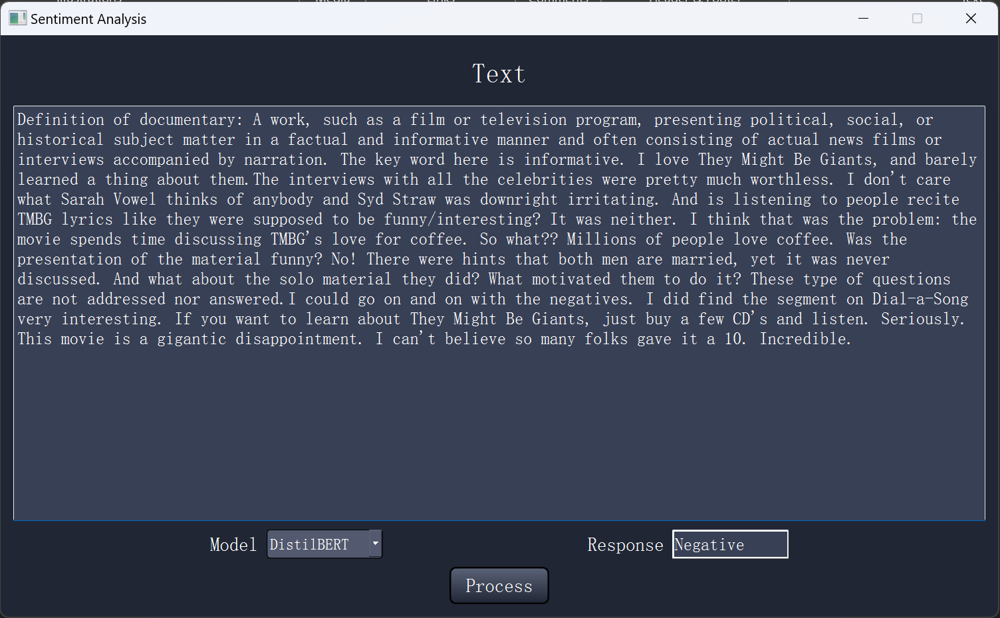
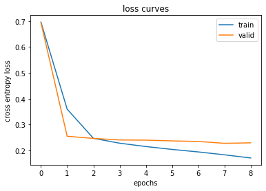
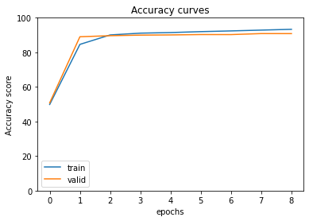

# Sentiment Analysis with finetuned DistilBERT


This project aims to finetune DistilBERT from HuggingFace on IMDB Movie Review Sentiment Analysis dataset.



### Dataset: 
[Kaggle machine translation](https://ai.stanford.edu/~amaas/data/sentiment/)


### Build: 

	CPU: Intel i9-13900H (14 cores)
	GPU: NVIDIA RTX 4060 (VRAM 8 GB)
	RAM: 32 GB


### Python Packages:

	conda install pytorch==2.1.2 torchvision==0.16.2 torchaudio==2.1.2 pytorch-cuda=12.1 -c pytorch -c nvidia
	conda install -c conda-forge pandas = 1.5.3
	conda install -c conda-forge tqdm = 4.64.1
	conda install -c conda-forge matplotlib = 3.8.0
	conda install -c conda-forge numpy = 1.26.4
		

### Training Curves

<p align="center">
  
  
</p>


### Code Structure:
```bash
├── GUI.py (Run to generate a GUI)
├── main.py (Run to train model)
├── distilBERT.py
├── fine_tuning.py
├── label_ind_map.pkl
├── visualization.py
├── summary.py
├── qt_main.ui

```
